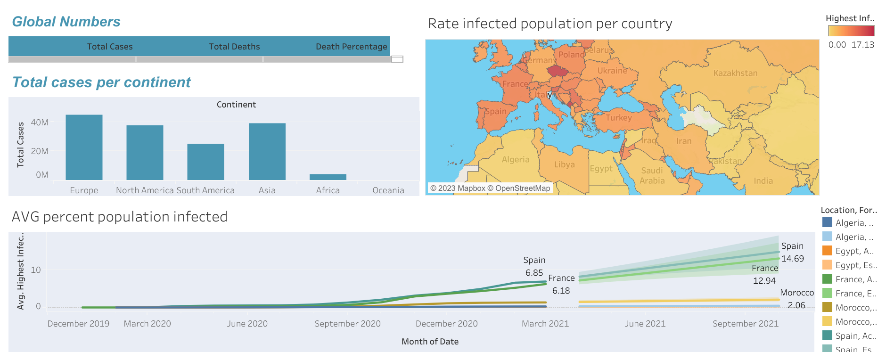
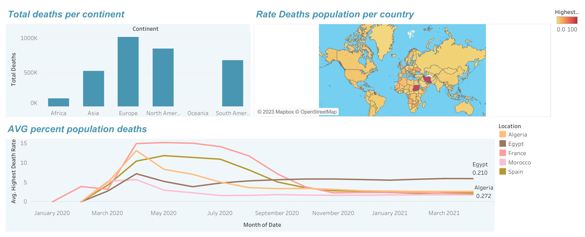

# COVID-19 Data Analysis Project

## Overview
An end-to-end data analysis project examining COVID-19 data using SQL for data exploration and Tableau for visualization.

## Tools Used
- SQL (data querying and analysis)
- Tableau (data visualization)
- Excel/CSV (data storage)

## Data Source
Data sourced from [Our World in Data COVID-19 dataset](https://ourworldindata.org/covid-deaths) covering cases, deaths, testing, and vaccinations globally.

## the final result:
### Covid Cases

### Covid Deaths

## Project Structure
1. **Data Exploration**: SQL queries to understand patterns, trends, and key metrics
2. **Data Visualization**: Tableau dashboards showing insights from the analysis

## SQL Analysis
The SQL scripts examine:
- Global infection rates and mortality
- Country-specific comparisons
- Vaccination progress
- Correlation between various factors

## Tableau Visualizations
The Tableau dashboard includes:
- Global infection map
- Time series analysis of cases and deaths
- Vaccination progress by country
- Comparative analysis across regions

## Key Findings
- [Add your key findings here]
- [Add your key findings here]
- [Add your key findings here]

## How to Reproduce
1. Download the data from the source above
2. Execute SQL queries from the included scripts
3. Import the results to Tableau
4. Use the Tableau workbook to visualize results

## Future Work
Potential extensions include analyzing:
- Long-term trends and seasonal patterns
- Economic impact correlation
- Healthcare capacity relationship to outcomes